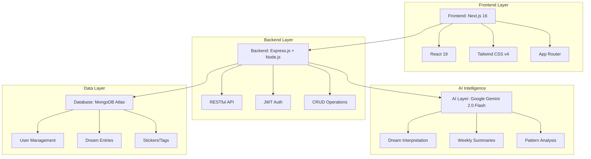

# 🌙 Dream Journal 2.0 – AI-Powered Dream Analysis Platform

> _"Transform your dreams into insights. Record, analyze, and understand your subconscious with AI."_

[](https://dream-journal-2-0.vercel.app)
[](https://dream-journal-2-0.onrender.com/api/health)

---

## 🌐 Live Deployment

- **Frontend**: [https://dream-journal-2-0.vercel.app](https://dream-journal-2-0.vercel.app)
- **Backend API**: [https://dream-journal-2-0.onrender.com](https://dream-journal-2-0.onrender.com)

---

## 🧩 Overview

**Dream Journal 2.0** is an intelligent dream journaling platform that helps users record, organize, and analyze their dreams using **AI-powered interpretation with Google Gemini**. The application provides deep insights into dream patterns, emotions, and symbols, helping users understand their subconscious mind.

### Key Highlights

- 🤖 **AI-Powered Interpretation** using Google Gemini 2.0 Flash
- 🎨 **Colorful Stickers** for dream categorization
- 📊 **Advanced Analytics** with mood tracking and pattern detection
- 🔍 **Smart Search & Filters** with pagination and sorting
- 📝 **Weekly AI Summaries** of dream patterns and insights
- 🔐 **Secure Authentication** with JWT and HTTP-only cookies

---

## 🧠 Problem Statement

People often forget their dreams shortly after waking, missing valuable opportunities for **self-reflection** and **emotional awareness**. Traditional dream journals are static text records that don't provide deeper analysis or reveal patterns over time.

**Dream Journal 2.0** solves this by:
- Using **AI interpretation** to uncover hidden meanings and emotions
- **Tracking patterns** across multiple dreams to identify recurring themes
- Providing **visual analytics** to understand emotional trends
- Generating **weekly summaries** with personalized insights

---

## 🏗️ System Architecture



---

## 🧱 Tech Stack

### Frontend
| Technology | Version | Purpose |
|------------|---------|---------|
| **Next.js** | 16.0.7 | React framework with App Router |
| **React** | 19.2.0 | UI library with latest features |
| **Tailwind CSS** | v4 | Modern utility-first styling |
| **PostCSS** | v4 | CSS processing |

### Backend
| Technology | Version | Purpose |
|------------|---------|---------|
| **Node.js** | Latest | Runtime environment |
| **Express** | 5.1.0 | Web framework |
| **MongoDB** | 8.19.3 | NoSQL database |
| **Mongoose** | 8.19.3 | MongoDB ODM |
| **JWT** | 9.0.2 | Authentication |
| **bcryptjs** | 3.0.3 | Password hashing |
| **Google Generative AI** | 0.24.1 | Gemini AI integration |

### DevOps & Deployment
- **Frontend Hosting**: Vercel
- **Backend Hosting**: Render
- **Database**: MongoDB Atlas (Cloud)
- **Version Control**: Git & GitHub

---

## ✨ Key Features

### 🔐 Authentication & Security
- JWT-based authentication with HTTP-only cookies
- Secure password hashing with bcryptjs
- Protected routes and middleware
- CORS configuration for cross-origin requests

### 📖 Dream Management (Full CRUD)
- **Create**: Record dreams with title, description, date, mood, and stickers
- **Read**: View all dreams with pagination, search, sort, and filters
- **Update**: Edit dream details and reassign stickers
- **Delete**: Remove dreams with confirmation modals

### 🤖 AI-Powered Features
- **Dream Interpretation**: Deep psychological analysis using Gemini 2.0 Flash
- **Weekly Summaries**: AI-generated insights from the last 7 days of dreams
- **Pattern Detection**: Identifies recurring themes, emotions, and symbols
- **Smart Formatting**: AI responses with bold text, numbered lists, and structure

### 🎨 Sticker System
- Create colorful stickers/tags to organize dreams
- Assign multiple stickers per dream
- Filter dreams by stickers
- Full CRUD operations on stickers

### 📊 Analytics Dashboard
- **Mood Distribution**: Visual charts showing emotional patterns
- **Dream Statistics**: Total dreams, weekly count, AI-analyzed dreams
- **Recent Activity**: Quick access to latest dream entries
- **Trend Analysis**: Identify patterns over time

### 🔍 Advanced Search & Filtering
- **Search**: Find dreams by title or description
- **Sort**: By date, mood, favorites, or creation time
- **Filter**: By mood, favorites, date range, or stickers
- **Pagination**: Navigate through dreams efficiently (9 per page)

### 🎯 User Experience
- **Glass-morphism Design**: Modern UI with backdrop blur effects
- **Gradient Themes**: Blue-to-purple color scheme throughout
- **Responsive Layout**: Works on desktop, tablet, and mobile
- **Interactive Cards**: Hover effects and smooth transitions
- **Dark Mode**: Night-themed interface for comfortable viewing

---

## 🧾 API Endpoints

### Authentication
| Endpoint | Method | Description | Access |
|----------|--------|-------------|--------|
| `/api/auth/signup` | POST | Register new user | Public |
| `/api/auth/login` | POST | Authenticate user | Public |
| `/api/auth/logout` | POST | End user session | Authenticated |
| `/api/auth/me` | GET | Get current user profile | Authenticated |

### Dreams
| Endpoint | Method | Description | Access |
|----------|--------|-------------|--------|
| `/api/dreams` | GET | Fetch all dreams (with filters, sorting, pagination) | Authenticated |
| `/api/dreams` | POST | Create a new dream entry | Authenticated |
| `/api/dreams/:id` | GET | Fetch a specific dream | Authenticated |
| `/api/dreams/:id` | PUT | Update a dream entry | Authenticated |
| `/api/dreams/:id` | DELETE | Delete a dream entry | Authenticated |

**Query Parameters for GET /api/dreams:**
- `page`: Page number (default: 1)
- `limit`: Items per page (default: 10)
- `search`: Search in title and description
- `sort`: Sort field (e.g., `dreamDate:desc`, `createdAt:asc`)
- `mood`: Filter by mood
- `isFavorite`: Filter favorites (true/false)
- `dateFrom`: Filter dreams from date
- `dateTo`: Filter dreams to date
- `tags`: Filter by sticker ID

### Stickers/Tags
| Endpoint | Method | Description | Access |
|----------|--------|-------------|--------|
| `/api/tags` | GET | Fetch all stickers (with pagination) | Authenticated |
| `/api/tags` | POST | Create a new sticker | Authenticated |
| `/api/tags/:id` | GET | Fetch a specific sticker | Authenticated |
| `/api/tags/:id` | PUT | Update a sticker | Authenticated |
| `/api/tags/:id` | DELETE | Delete a sticker | Authenticated |

### AI Features
| Endpoint | Method | Description | Access |
|----------|--------|-------------|--------|
| `/api/ai/interpret` | POST | Generate AI interpretation for a dream | Authenticated |
| `/api/ai/summary/weekly` | GET | Get weekly dream summary | Authenticated |

---

## 🎨 UI Components

### Dashboard Pages
- **Main Dashboard**: Overview with stats, quick actions, and recent activity
- **Dreams Page**: Grid view with search, filters, and dream cards
- **Dream Detail**: Full dream view with AI interpretation
- **Stickers Page**: Manage colorful tags for organization
- **Analytics Page**: Mood distribution and dream statistics
- **Summary Page**: AI-generated weekly insights

### Reusable Components
- **Glass Card**: Modern card with backdrop blur
- **Pagination**: Navigate through paginated lists
- **Delete Modal**: Confirmation dialog for deletions
- **Dream Card**: Interactive dream display with click-to-view
- **Dream Form**: Comprehensive form for dream entry
- **Dream Filters**: Advanced filtering sidebar
- **Tag Card**: Sticker display with color indicators
- **Topbar**: Header with user info and stats
- **Sidebar**: Navigation menu with glass effect

---

## 🚀 Getting Started

### Prerequisites
- Node.js (v18 or higher)
- MongoDB Atlas account
- Google Gemini API key

### Installation

1. **Clone the repository**
   ```bash
   git clone https://github.com/rravya14/Dream-Journal-2.0.git
   cd Dream-Journal-2.0
   ```

2. **Backend Setup**
   ```bash
   cd backend
   npm install
   ```

   Create `.env` file:
   ```env
   PORT=5000
   MONGODB_URI=your_mongodb_connection_string
   JWT_SECRET=your_jwt_secret_key
   GEMINI_API_KEY=your_gemini_api_key
   NODE_ENV=development
   ```

   Start backend:
   ```bash
   npm run dev
   ```

3. **Frontend Setup**
   ```bash
   cd frontend
   npm install
   ```

   Create `.env.local` file:
   ```env
   NEXT_PUBLIC_API_BASE_URL=http://localhost:5000/api
   ```

   Start frontend:
   ```bash
   npm run dev
   ```

4. **Access the application**
   - Frontend: http://localhost:3000
   - Backend API: http://localhost:5000

---

## 📱 Features Walkthrough

### 1. Authentication
- Sign up with name, email, and password
- Secure login with JWT tokens
- Persistent sessions via HTTP-only cookies
- Logout functionality with session cleanup

### 2. Recording Dreams
- Add title (3-200 characters)
- Write detailed description (minimum 10 characters)
- Select dream date
- Choose mood (happy, sad, anxious, calm, confused, excited, fearful, neutral)
- Assign colorful stickers for categorization
- Mark as favorite

### 3. AI Interpretation
- Click "Analyze with AI" on any dream
- Get comprehensive psychological analysis
- Formatted output with headings and bold text
- Insights on emotions, symbols, and meanings
- Regenerate for alternative interpretations

### 4. Analytics & Insights
- View mood distribution across all dreams
- Track dream frequency (weekly, monthly)
- Identify most common emotions
- See recent dream activity
- Click on any dream to view details

### 5. Weekly Summary
- AI analyzes last 7 days of dreams
- Identifies recurring patterns and themes
- Provides personalized insights
- Suggests reflection points
- Generated on-demand with Gemini AI

---

## 🎯 Project Goals

- ✅ Provide a beautiful, intuitive interface for dream journaling
- ✅ Leverage AI to help users understand dream symbolism and emotions
- ✅ Track patterns and trends over time with analytics
- ✅ Promote mental wellness through self-reflection
- ✅ Make dream interpretation accessible to everyone
- ✅ Create a responsive, modern web application
- ✅ Implement secure authentication and data protection

---

## 🔒 Security Features

- **Password Hashing**: bcryptjs with salt rounds
- **JWT Tokens**: Secure authentication tokens
- **HTTP-Only Cookies**: Protected from XSS attacks
- **CORS Configuration**: Controlled cross-origin access
- **Input Validation**: Server-side validation on all endpoints
- **Protected Routes**: Middleware authentication checks
- **Environment Variables**: Sensitive data stored securely

---

## 🧠 AI Integration Details

### Google Gemini 2.0 Flash Experimental
- **Model**: `gemini-2.0-flash-exp`
- **Lazy Loading**: Initialized only when needed
- **Dream Interpretation**: Psychological analysis with structured formatting
- **Weekly Summaries**: Pattern analysis across multiple dreams
- **Smart Formatting**: Automatic detection and formatting of headings, lists, and emphasis

### Prompts Used
1. **Dream Interpretation**: Analyzes title, description, mood, and date for comprehensive insights
2. **Weekly Summary**: Evaluates 7 days of dreams to find patterns and provide reflections

---

## 📊 Database Schema

### User Model
```javascript
{
  name: String (required),
  email: String (required, unique),
  password: String (required, hashed),
  createdAt: Date,
  updatedAt: Date
}
```

### Dream Model
```javascript
{
  userId: ObjectId (ref: User),
  title: String (3-200 chars),
  description: String (min 10 chars),
  dreamDate: Date,
  mood: String (enum),
  tags: [ObjectId] (ref: Tag),
  isFavorite: Boolean,
  aiInterpretation: String,
  aiImageUrl: String,
  emotions: [String],
  symbols: [String],
  createdAt: Date,
  updatedAt: Date
}
```

### Tag/Sticker Model
```javascript
{
  userId: ObjectId (ref: User),
  name: String (1-50 chars, unique per user),
  color: String (hex color),
  createdAt: Date,
  updatedAt: Date
}
```

---

## 🎨 Design System

### Color Palette
- **Primary Gradient**: Blue (#3B82F6) to Purple (#A855F7)
- **Background**: Dark slate (#0F172A, #1E293B)
- **Text**: White (#FFFFFF), Slate-400 (#94A3B8)
- **Accents**: Blue-400, Purple-400, Pink-400

### Typography
- **Headings**: 3xl bold with gradient text
- **Body**: Regular weight, slate-400
- **Labels**: Small, medium weight

### Components
- **Glass Effect**: Backdrop blur with transparency
- **Rounded Corners**: 2xl for cards, xl for inputs/buttons
- **Shadows**: Subtle with purple glow on hover
- **Animations**: Scale and fade transitions (200ms)

---

## 🤝 Contributing

This is a personal project for educational purposes. If you'd like to contribute or have suggestions:

1. Fork the repository
2. Create a feature branch (`git checkout -b feature/AmazingFeature`)
3. Commit your changes (`git commit -m 'Add some AmazingFeature'`)
4. Push to the branch (`git push origin feature/AmazingFeature`)
5. Open a Pull Request

---

## 📄 License

This project is licensed under the MIT License.

---

## 👨‍💻 Author

**Bhavya Ravya**
- GitHub: [@rravya14](https://github.com/rravya14)
- Project: Dream Journal 2.0

---

## 🙏 Acknowledgments

- **Google Gemini AI** for powerful dream interpretation
- **Vercel** for seamless frontend hosting
- **Render** for reliable backend deployment
- **MongoDB Atlas** for cloud database services
- **Next.js Team** for the amazing React framework
- **Tailwind CSS** for the utility-first CSS framework

---

## 📚 References

- [Google Gemini API Documentation](https://ai.google.dev/docs)
- [Next.js Documentation](https://nextjs.org/docs)
- [MongoDB Documentation](https://docs.mongodb.com)
- [Express.js Guide](https://expressjs.com)
- [JWT Best Practices](https://jwt.io/introduction)

---

## 🏁 Summary

> **Dream Journal 2.0** transforms dream journaling into an interactive, AI-powered experience.  
> It doesn't just store dreams — it interprets them, visualizes patterns, and helps users understand their subconscious mind through advanced analytics and artificial intelligence.

**Live Demo**: [https://dream-journal-2-0.vercel.app](https://dream-journal-2-0.vercel.app)

---
