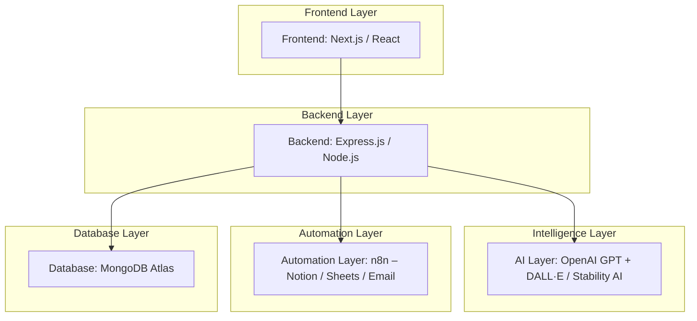

# 🌙 Dream Journal 2.0 – AI Dream Interpreter

> _“Turn your dreams into insights. Reflect, visualize, and understand your subconscious.”_

---

## 🧩 Overview

**Dream Journal 2.0** is an intelligent journaling platform that helps users record, analyze, and visualize their dreams using **AI-powered emotional and symbolic interpretation**.  
It transforms each dream entry into an interactive **Dream Card** — complete with an AI-generated summary, emotion insights, and dream visuals.

---

## 🧠 Problem Statement

People often forget their dreams soon after waking, missing opportunities for **self-reflection** and **emotional awareness**.  
Traditional dream journals are static — they record text but don’t analyze meaning or mood.

**Dream Journal 2.0** uses **AI interpretation** and **data visualization** to turn dreams into meaningful emotional patterns, helping users track their subconscious over time.

---

## 🏗️ System Architecture

### 🧱 Architecture Flow (Mermaid Diagram)

---

## 🧱 Tech Stack

| Layer | Technologies |
|--------|--------------|
| **Frontend** | Next.js / React, TailwindCSS |
| **Backend** | Node.js + Express |
| **Database** | MongoDB Atlas |
| **AI Integration** | OpenAI GPT (text), DALL·E or Stability AI (image) |
| **Automation** | n8n (Notion API, Gmail API, Google Sheets API) |
| **Authentication** | JWT-based secure cookies |
| **Hosting** | Vercel (Frontend), Render/Railway (Backend) |

---

## ✨ Key Features

| Category | Description |
|-----------|--------------|
| **Authentication** | Secure signup/login using JWT cookies |
| **CRUD Operations** | Create, Read, Update, and Delete dream entries |
| **AI Interpretation** | GPT interprets dreams symbolically and emotionally |
| **Dream Visualization** | DALL·E / Stability AI generates unique dream art |
| **Search / Filter / Sort / Pagination** | Filter dreams by emotion, symbol, or date |
| **Mind Pattern Analytics** | Detect recurring emotions and symbols |
| **Weekly Mind Summary** | AI summarizes patterns and emotional insights |
| **Automation (n8n)** | Sync to Notion or Google Sheets, email reminders |
| **Dashboard & Analytics** | Visual graphs showing emotional and symbolic trends |

---

## 🌀 The Twist — AI-Powered “Mind Summaries”

Beyond journaling, Dream Journal 2.0 detects **emotional trends** and **recurring dream themes**.

For example:  
> “You dream about running when you’re stressed.”  
> “Love themes appear when you’re feeling happy.”

Users receive **weekly mind summaries**, **visual graphs**, and **AI-powered reflection tips** to promote mindfulness and emotional growth.

---

## 🧾 API Overview

| Endpoint | Method | Description | Access |
|-----------|---------|-------------|---------|
| `/api/auth/signup` | POST | Register new user | Public |
| `/api/auth/login` | POST | Authenticate user | Public |
| `/api/dreams` | POST | Add a new dream (typed or voice) | Authenticated |
| `/api/dreams` | GET | Fetch all dreams (with filters, sorting, pagination) | Authenticated |
| `/api/dreams/:id` | GET | Fetch a specific dream entry | Authenticated |
| `/api/dreams/:id` | PUT | Update a dream entry | Authenticated |
| `/api/dreams/:id` | DELETE | Delete a dream entry | Authenticated |
| `/api/dreams/analyze` | POST | Generate AI interpretation and Dream Card | Authenticated |
| `/api/dreams/summary` | GET | Fetch weekly AI summary | Authenticated |

---

## 🧩 System Components

- **Frontend:** Built with React/Next.js and TailwindCSS for a dynamic, responsive UI.  
- **Backend:** Express.js handles all logic, routes, and authentication.  
- **AI Layer:** Uses GPT for text interpretation and DALL·E/Stability for image generation.  
- **Automation:** n8n automates data syncs, weekly summaries, and email reminders.  
- **Database:** MongoDB Atlas stores dream entries, AI insights, and user data.  

---

## 🧭 Project Goals

- Help users **reflect** on subconscious thoughts and emotions.  
- Provide **AI-driven insights** into recurring dreams and mental patterns.  
- Create a **visually appealing and interactive** journaling experience.  
- Promote **mental wellness and mindfulness** through data-driven awareness.

---

## 🚀 Hosting Plan

| Service | Purpose |
|----------|----------|
| **Frontend** | Vercel |
| **Backend** | Render / Railway |
| **Database** | MongoDB Atlas |
| **Automation** | n8n Cloud |
| **AI Layer** | OpenAI / Stability API |

---

## 🔒 Authentication Flow

1. User signs up with **username, email, and password**.  
2. Backend validates and **hashes password** using bcrypt.  
3. On login, a **JWT** is created and stored in a **secure HTTP-only cookie**.  
4. User stays logged in until cookie expiry or manual logout.  

---

## 🧠 Weekly Mind Summary Example

**Example Insight:**

> “You’ve had 5 dreams involving ‘running’ this week, mostly during periods of stress.  
> Try relaxation before bedtime to reduce anxiety.”  

Dream Journal 2.0 transforms this into a **weekly report**, complete with **emotion charts** and **personalized suggestions**.

---

## 🪄 Example Dream Card

| Field | Example |
|--------|----------|
| **Title** | “Running Through the Forest” |
| **Emotion** | Anxiety, urgency |
| **Symbols** | Forest, running, chase |
| **AI Interpretation** | “This dream reflects your tendency to avoid unresolved stress or challenges.” |
| **AI Image** | Automatically generated by DALL·E |
| **Created** | November 2025 |

---

## 📘 References

- [OpenAI API Documentation](https://platform.openai.com/docs)  
- [Stability AI DreamStudio](https://platform.stability.ai/docs)  
- [n8n Automations](https://n8n.io)  
- [MongoDB Atlas](https://www.mongodb.com/cloud/atlas)  
- [Render Hosting](https://render.com)

---

## 👩‍💻 Team

| Role | Name |
|------|------|
| Developer & Researcher | **Bhavya [Your Last Name]** |
| Mentor / Advisor | _[Your Teacher / Mentor Name]_ |

---

## 🏁 Summary

> **Dream Journal 2.0** bridges creativity and emotional awareness through AI.  
> It doesn’t just store dreams — it interprets them, visualizes them, and helps users understand their inner world.

---